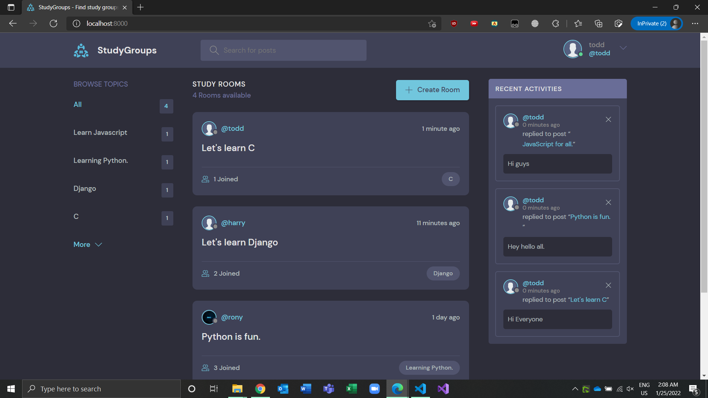
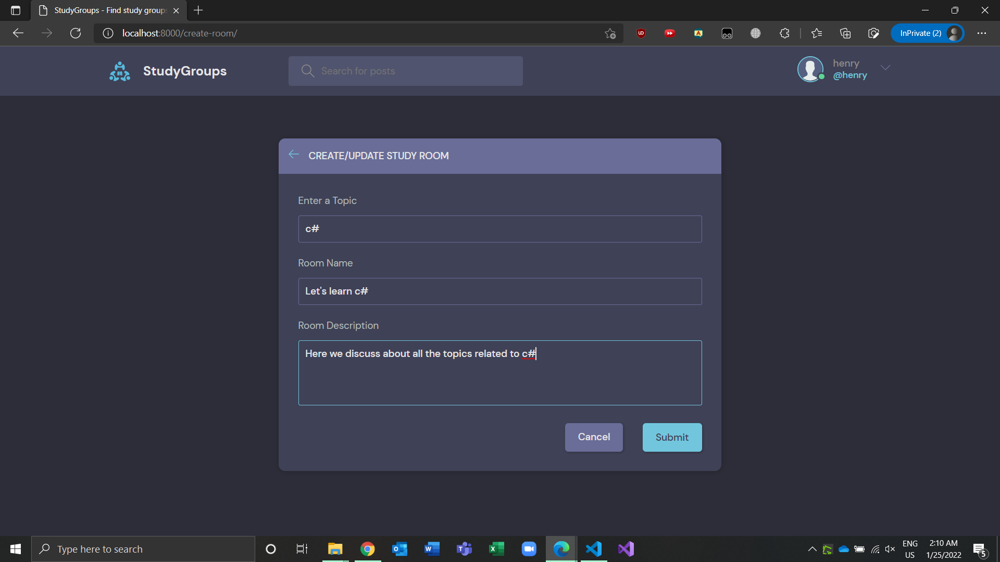
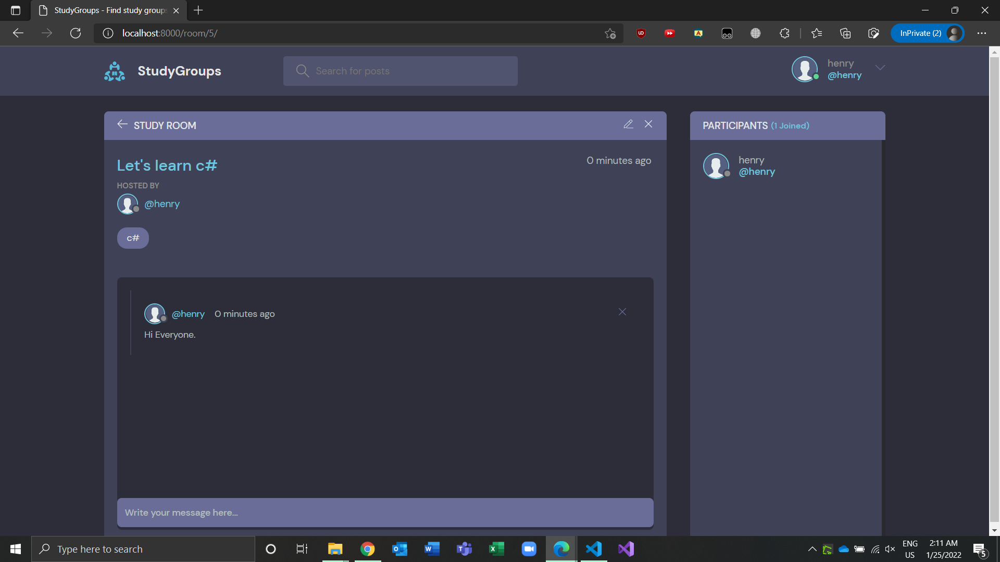
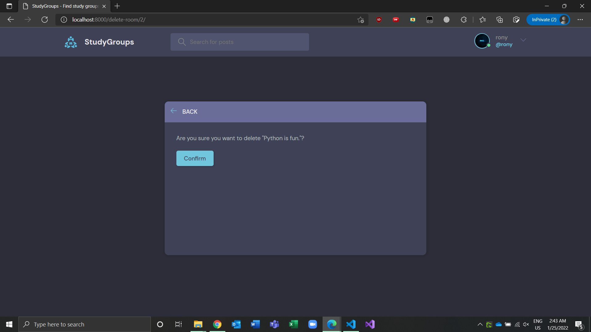
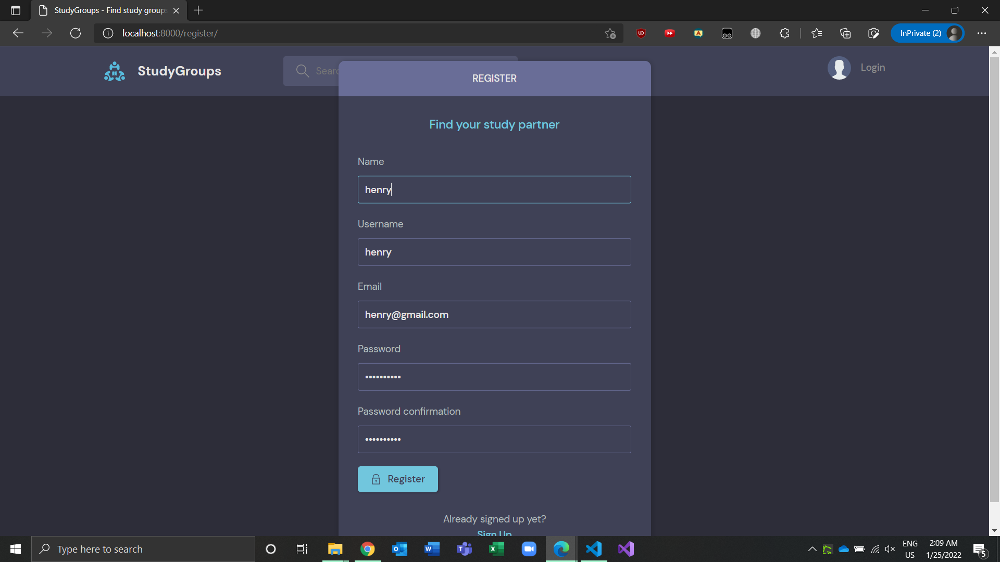
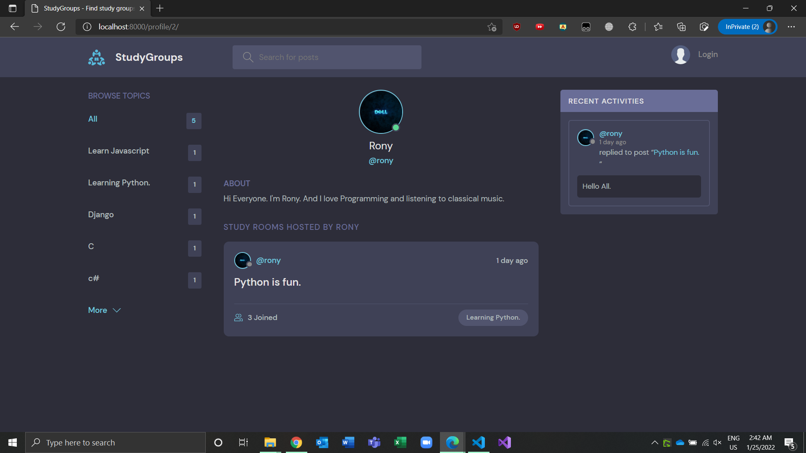
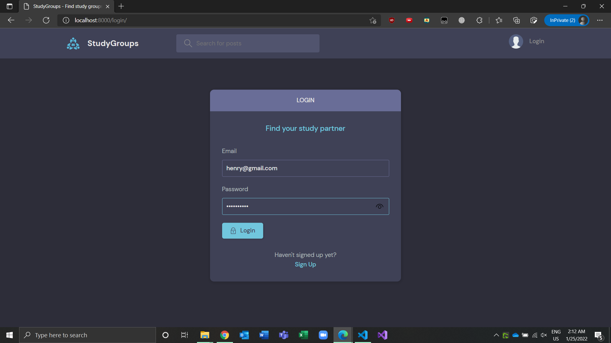
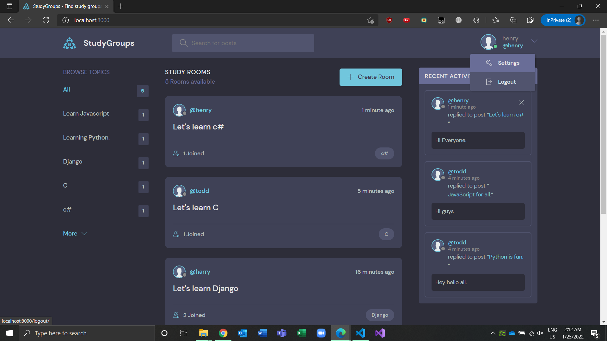

<h1 align="center">
  <br>
  <a href="https://study-groups.herokuapp.com/">
    
    <br>
        StudyGroups
    <br>
  </a> 
  <br>
</h1>

# study-groups

---

A study-groups app made with python Django framwork and MVT (model view template) Architecture.

# Main Features:

---

- Users can crate rooms.
- Users can chat in the rooms.
- Users can update the room details.
- Users can delete rooms.
- Users can see activity inside a room.
- Users can edit their profile details.
- Users can delete messages.
- Users can search for a specific room name or description or topic.
- Uers can register themselves.
- Users can login and logout.
- Users can delete their specific activities.
- User authentication and authorization is there.

# Screenshots:

---

Home Page:



Create Room:



Room Details:



Delete Room:



Register User:



User Details:



Login:



Logout:



# Installation and setup instructions:

---

First clone down this repository. You will need python and pip installed on your system.

it is recommended to create a virtual environment for your project. So that all the dependencies will be installed on this virtual environment and not globally.

### Server:

---

##### Setup of Virtual Environment:

If you want all your dependencies installed globally on your machine you can skip this part.

to create a virtual environment and active it first go to the directory where you cloned this repository and type the following commands.

```
$ python -m venv env
$ source env/Scripts/activate
```

now the virtual environment will be activated. To deactivate type

```
$ deactivate
```

##### installation of dependencies:

To install dependencies type the following command.

```
$ pip install -r requirements.txt
```

##### migrate:

To migrate run the following commands.

```
$ python manage.py makemigrations
$ python manage.py migrate
```

Now all the database schemas should be created at this point.

##### Start the server:

to start the server type

```
$ python manage.py runserver
```

This will let the server up and running.

##### Create Super User:

You can also create a superuser for your django admin panel. Though this part is optional. To crate a superuser just type the following command.

```
$ python manage.py createsuperuser
```

##### Loggin:

If you want loggin you can add the following part of code to your settings.py file in the StudyGroups directory.

```
LOGGING = {
    'version': 1,
    'disable_existing_loggers': False,
    'handlers': {
        'console': {
            'class': 'logging.StreamHandler',
        },
    },
    'loggers': {
        'django': {
            'handlers': ['console'],
            'level': os.getenv('DJANGO_LOG_LEVEL', 'DEBUG'),
        },
    },
}
```

Now this app is created using django's template engine. Means this app is server side rendered. So to visit this app go to your favourite browser and type following url in the search bar.

```
localhost:8000
```

Now this will let your app start and running.
